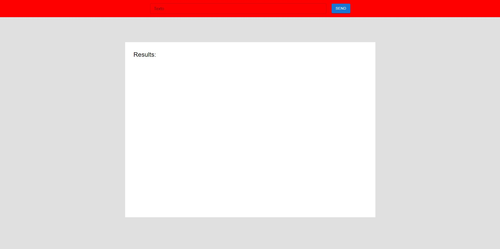
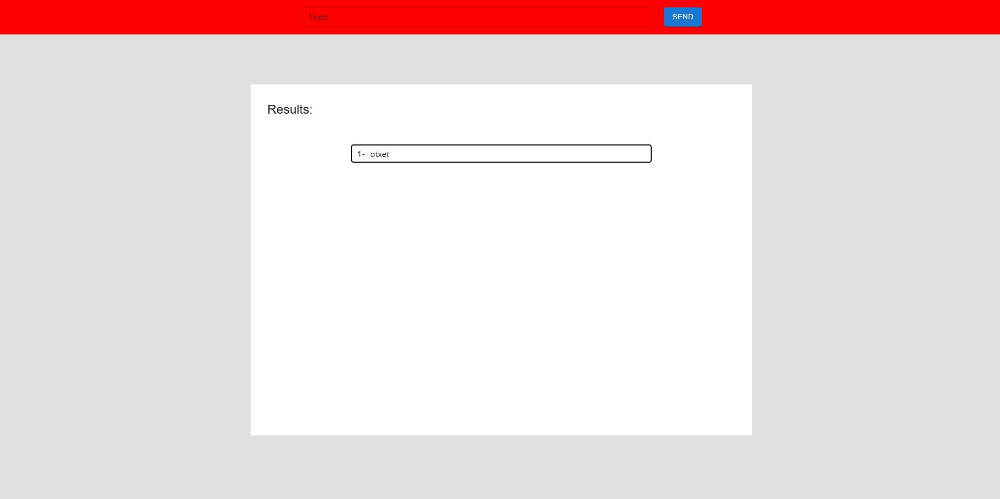
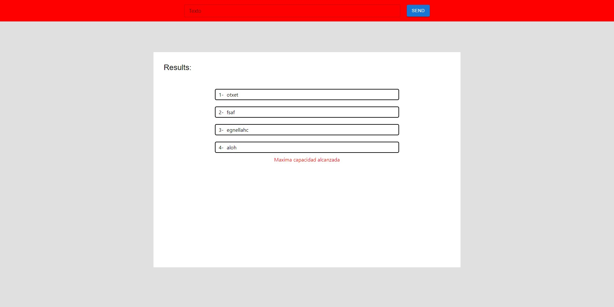

<h1 align='center'>Challenge Frontend</h1>

## Comenzando
- Clonar el repositorio para tenerlo en sus computadoras.

## Instalacion:

- npm install
- npm start

npm install para instalar las dependencias y poder correr localmente el repo
npm start para levantar el servidor frontend 

## Aclaración 

Para tener en funcionamiento correctamente el front primero debes levantar el backend (Repositorio ChallengeBackend)

## Descripción 

La web cuenta una searchbar que envia un texto al backend, y este, le devuelve el mismo invertido.

los textos se van acumulando

pero ojo , si pones mas de 4 textos te saldra un mensaje!

